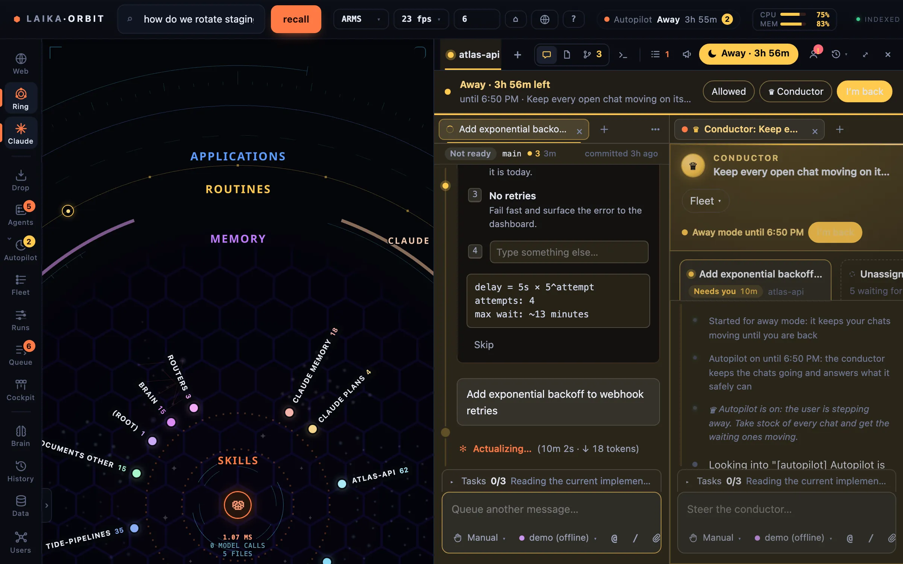

The Claude panel runs Claude Code chats inside Laika Orbit. Each chat is a real Claude Code session:
the same tools, permissions, `CLAUDE.md` files and MCP servers you get in the terminal.

*A chat in the `atlas-api` workspace: Claude reads a file, asks a question with numbered options, and a
second chat sits beside it. (This demo has no Claude account connected, so it runs the offline demo
agent.)*

## Workspaces: repos and project folders

Each repo gets its own workspace tab, in its own colour, with its chats, files, changes and a
terminal. Drag tabs to reorder them.

A **project folder** is a folder that holds several repos (for example `~/dev/my-studio`). Open it as
a workspace and Claude works across all of them.

Repos are found under `~/dev` by default. Set `DEV_ROOTS` (colon-separated) when you start the app to
look elsewhere.

## Groups, splits and the grid

Chats sit in groups, like editor groups in VS Code: split a group to put two chats side by side, drag a
tab into another group, or switch to a 2×2 grid of four.

| Keys | Action |
|---|---|
| <kbd>⌥</kbd><kbd>⌘</kbd><kbd>←</kbd> / <kbd>→</kbd> | Previous / next chat in the group |
| <kbd>⌃</kbd><kbd>⌘</kbd><kbd>←</kbd> / <kbd>→</kbd> | Move the chat to the group beside |
| <kbd>⌥</kbd><kbd>⌘</kbd><kbd>\\</kbd> | Split right |
| <kbd>⌥</kbd><kbd>⌘</kbd><kbd>G</kbd> | Toggle the 2×2 grid |
| <kbd>⌥</kbd><kbd>⌘</kbd><kbd>F</kbd> | Full-window Claude |
| <kbd>⌥</kbd><kbd>⌘</kbd><kbd>S</kbd> | Spread the tabs across the screen |

## Permission modes and models

New chats start in **Manual**: Claude asks before each edit. From the composer you can switch to:

- **Edit automatically:** edits without asking.
- **Plan:** explores and presents a plan before editing.
- **Auto:** approves actions that pass a safety check and pauses for anything risky.

The model picker offers Claude Code's default, Opus, Sonnet and Haiku.

## Accounts

Add a Claude account from the panel. Adding one runs Claude Code's own sign-in in a separate config
folder, so Laika Orbit never sees your credentials. Each chat shows which account it's on, and the
header shows usage for each account. Keep work and personal accounts apart this way; each account
remains subject to its own plan's terms and limits.

## While you're away

- **Task track:** the rail beside each chat lists its prompts as nodes, with the chat's goal, what it's
  doing now and what's next. Click a node to jump there.
- **Sub-agents** show as cards inside the chat, with their own steps.
- **Recovery:** chats run in a background host. If Claude Code crashes, the chat restarts; if the app
  or host restarts, open chats come back with the same history.
- **Duplicates:** a chat that's also open in another app (say, a terminal) waits until that copy
  closes, then comes back, so the same conversation never runs twice.

:::note[Chat summaries]
After each turn a small model writes the goal/now/next summary, on the chat's own account. Start the
app with `LAIKA_BRIEFS=0` to turn it off.
:::
