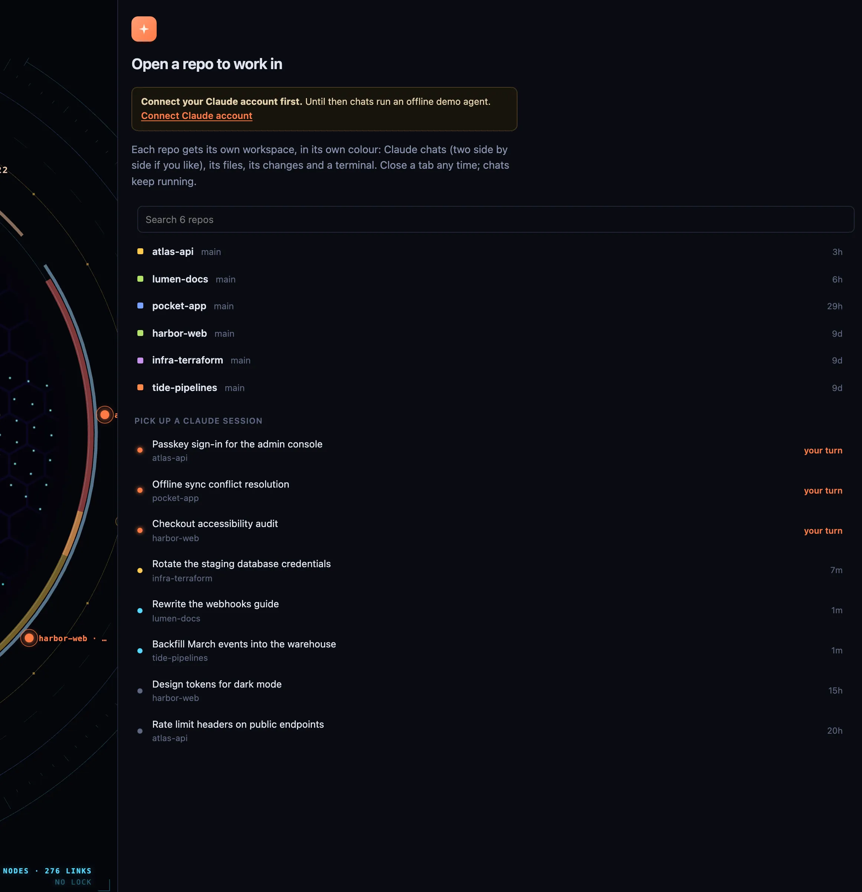

## Requirements

- **macOS** for the desktop app. The server and Laika Orbit recall also run on Linux.
- **Node 22.18 or newer** and **pnpm 10**. With [mise](https://mise.jdx.dev), `mise install` sets up both.
- **A Claude account** for chats (you can try the panel with an offline demo agent first).
- Optional: `brew install poppler` so PDFs are indexed (`pdftotext`).



*First run: pick a repo to open, or pick up a Claude session where you left it.*

## Install

Laika Orbit is free either way: build it from source below, or download the signed, notarised Mac
build from the [releases page](https://github.com/Laika-Dynamics-Ltd/laika-orbit/releases). There is
no updater yet, so new versions are a fresh download. [Orbit Pro](/pricing/), the paid membership on
top, isn't on sale yet; join the waitlist to hear when it opens.

```bash
git clone https://github.com/Laika-Dynamics-Ltd/laika-orbit.git
cd laika-orbit
mise install      # or use your own Node 22.18+ and pnpm 10
pnpm install
```

## Run it

```bash
pnpm shell                              # the desktop app, with real browser tabs
```

Or in a browser tab, without the native browser:

```bash
cd packages/app && node server.mjs      # http://localhost:5200
```

To install it as a Mac app in `/Applications` with a Dock icon:

```bash
pnpm shell:app
```

The app still runs from your checkout, so `git pull` updates it; relaunch to pick up changes.

## First run

1. **The map shows this repo only.** Nothing outside the checkout is read until you add a folder:
   press <kbd>i</kbd> and add sources (notes, projects, documents). See
   [Knowledge map](/docs/knowledge-map/).
2. **The Claude panel lists your repos** from `~/dev`. Keep code somewhere else? Start the server with
   `DEV_ROOTS`, colon-separated: `DEV_ROOTS="$HOME/code:$HOME/work" pnpm shell`.
3. **Connect a Claude account** from the panel. Until then, chats run an offline demo agent.
4. **Optional feeds:** copy `.env.example` to `.env.local` to set up the calendar and inbox widgets.
   See [Widgets](/docs/widgets/).

## Updating

```bash
git pull && pnpm install
```

Your settings live in gitignored files (`*.local.json`, `.env.local`, and the settings the app
writes), so updates never conflict with them.
