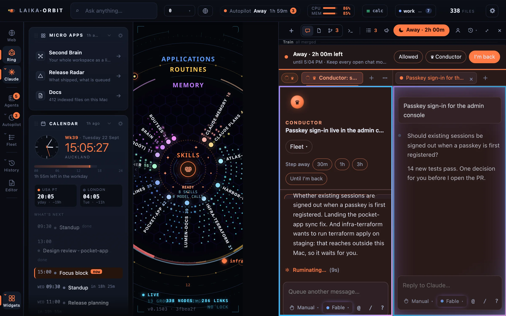

**Laika Orbit** is a desktop workspace for people who work with Claude Code all day. One window holds:

- **The Claude panel:** many Claude Code chats side by side, per repo or per project folder, on one or
  several Claude accounts.
- **Away mode:** leave your chats running for hours, with the plainly safe steps approved for you,
  and come back to one summary card. See [Away mode](/docs/away-mode/).
- **The knowledge map:** every indexed file, repo, chat and routine as a 3D map you can search and fly
  through.
- **A real browser:** Chromium tabs with one storage profile per account, and Chrome extensions.
- **Widgets:** inbox, calendar, agents, routines and anything else you describe in a JSON file.

*One window: the knowledge map beside the Claude panel. Every screenshot in these docs is taken on a
demo workspace of made-up repos and files.*

Underneath is **Laika Orbit recall**, a retrieval engine that answers questions about your files without calling
a model. It ships on its own too, as a CLI and an MCP server for Claude Code.

:::note[Preview]
Laika Orbit is a macOS preview, built from source. Laika Orbit recall runs anywhere Node 22 runs.
:::

## Where to start

- **Want the whole workspace?** [Install and first run](/docs/getting-started/).
- **Only want better recall in Claude Code?** [Use Laika Orbit recall with Claude Code](/docs/recall/mcp/), one
  command, no clone needed.

## How it relates to Claude

Laika Orbit runs Claude Code: each chat is a Claude Code session using your own Claude account. It is
not made by, affiliated with, or endorsed by Anthropic.
