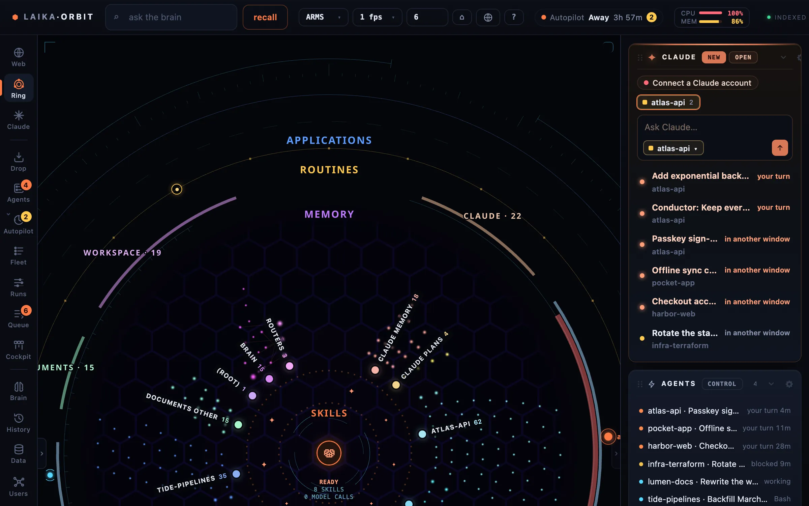

The map draws everything Laika Orbit recall has indexed, grouped by what it is (plans, specs, legal, code…) and
where it lives. Chats and routines orbit alongside.

*Files, chats and routines grouped in rings by what they are, with each repo's chats around the edge.*

## Moving around

| Keys | Action |
|---|---|
| Drag | Pan |
| <kbd>⌥</kbd> drag, or right/middle button | Orbit |
| Scroll | Zoom to the pointer |
| <kbd>W</kbd> <kbd>A</kbd> <kbd>S</kbd> <kbd>D</kbd> | Fly (hold <kbd>⇧</kbd> for speed) |
| <kbd>Q</kbd> <kbd>E</kbd> · <kbd>↑</kbd> <kbd>↓</kbd> | Orbit · tilt |
| <kbd>0</kbd> | Reset the view |
| <kbd>f</kbd> | Frame the selected node |
| <kbd>1</kbd> <kbd>2</kbd> <kbd>3</kbd> | Layouts: ARMS · Rings · Packed |

Click a node to open it; double-click flies to it. <kbd>space</kbd> previews the selected file.

## Search

<kbd>⌘</kbd><kbd>K</kbd> (or <kbd>/</kbd>) opens spotlight: files, actions, and questions answered
by Laika Orbit recall.

## What gets indexed

Press <kbd>i</kbd> for the index settings. Out of the box only the Laika Orbit folder itself is
indexed. Add **sources** (any folder, such as `~/Documents/Projects` or `~/dev`) and choose, for each:

- which files to include or exclude (glob patterns)
- whether to index file contents or only names
- how deep to go

The same settings are used by the CLI and the MCP server. They're saved to
`brain/index.config.json`; see [Index configuration](/docs/recall/configuration/).

`.docx`, `.rtf` and `.odt` files are read with macOS `textutil`, and PDFs with `pdftotext` when it's
installed.
