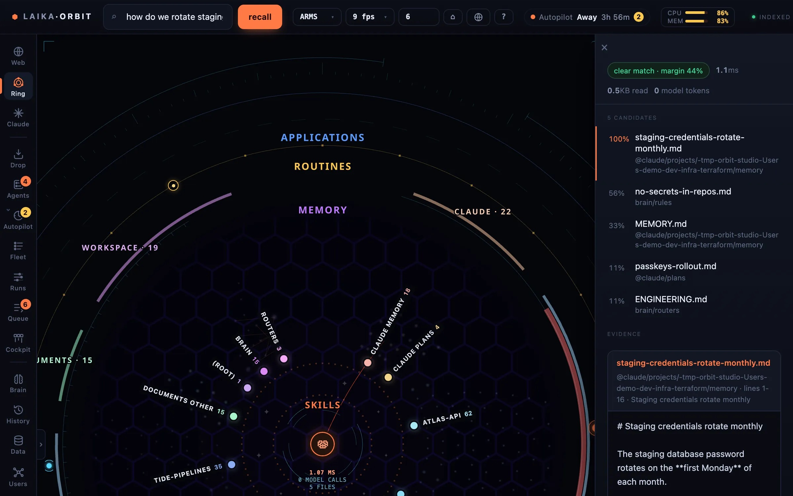

Laika Orbit recall answers questions about a folder of files without calling a model. Ask a question and it
returns the exact section that answers it and the file it came from, in about a millisecond.

*Asking the workspace a question: ranked candidates, a confidence margin, the matching section, and the
cost — 1.6ms and no model tokens.*

It exists because agents answer questions about a workspace by grepping and then reading whole files,
and every line they open costs context whether or not it was relevant. Laika Orbit recall does the searching and
narrowing in plain code, then hands the model one small, packed answer. Measured against a
grep-and-read agent over the same corpus, it put **97.8% fewer tokens** into context across 12
questions ([methodology](https://github.com/Laika-Dynamics-Ltd/laika-orbit/blob/main/bench/RESULTS.md)).

## Two ways to use it

- **In Claude Code**, as an MCP server: `claude mcp add 1brain -- npx -y 1brain mcp`.
  [Details](/docs/recall/mcp/).
- **In the terminal**: `npx 1brain recall "…"`. [CLI reference](/docs/recall/cli/).

It works on any folder of Markdown and text, and answers best when you add
[router files](/docs/recall/routers/).

## What it isn't

Not semantic search, and not a vector database. It matches words, weighted by where they appear. That
makes it fast, predictable and free to run, and it reports **no match** plainly instead of guessing.
Recall quality depends on your router files more than on the engine.
