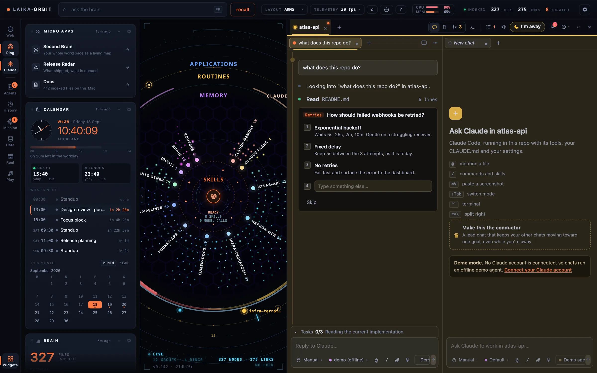

Widgets sit on the side rails (<kbd>[</kbd> and <kbd>]</kbd> toggle them). Every widget is one JSON
file in `brain/widgets/`, so **adding a widget is adding a file**. No code, no rebuild.



*Widgets on the side rails: micro apps, the calendar and what the index holds.*

## Calendar

Put your calendar's secret iCal address in `.env.local`:

```bash
CALENDAR_ICS_URLS=https://calendar.google.com/calendar/ical/…/basic.ics
# several: separate with commas
```

In Google Calendar it's under Settings → your calendar → Integrate calendar → "Secret address in iCal
format".

## Inbox (Gmail)

1. Create an OAuth client in your own Google Cloud project with the Gmail read-only scope.
2. Add `http://localhost:5200/api/gmail/callback` as an authorised redirect URI.
3. Put the client in `.env.local`:

   ```bash
   GOOGLE_CLIENT_ID=…
   GOOGLE_CLIENT_SECRET=…
   ```

4. Restart the app and connect from the inbox widget. The refresh token is kept in the macOS Keychain.

"Needs you" counts unread mail from real people rather than newsletters and notifications.

## Your own widgets

```jsonc
{
  "id": "deploys",            // unique; also the filename: brain/widgets/deploys.json
  "kind": "list",             // calendar | metric | table | deck | applist | list | feed | links
  "title": "Deploys",
  "icon": "deploy",           // optional
  "source": "ci",             // shown in the footer
  "refreshedAt": "2026-09-17T02:10:00Z",
  "href": "https://…",        // optional: the title becomes a link
  "config": { "staleAfterMins": 30 },
  "items": [
    { "title": "api · v2.3.1", "meta": "12:04", "tag": "live", "href": "https://…" }
  ]
}
```

Write the file from anything: a script, a cron job, or a Claude Code routine. Or post it to the running
app:

```bash
curl -X POST http://localhost:5200/api/widgets/deploys \
  -H 'content-type: application/json' -d @deploys.json
```

A widget older than `config.staleAfterMins` (default 60) is marked stale rather than shown as current.

Icons: `apps` `calendar` `mail` `bolt` `clock` `brain` `chart` `gauge` `doc` `deploy` `chat` `link`
`list` `play`.
